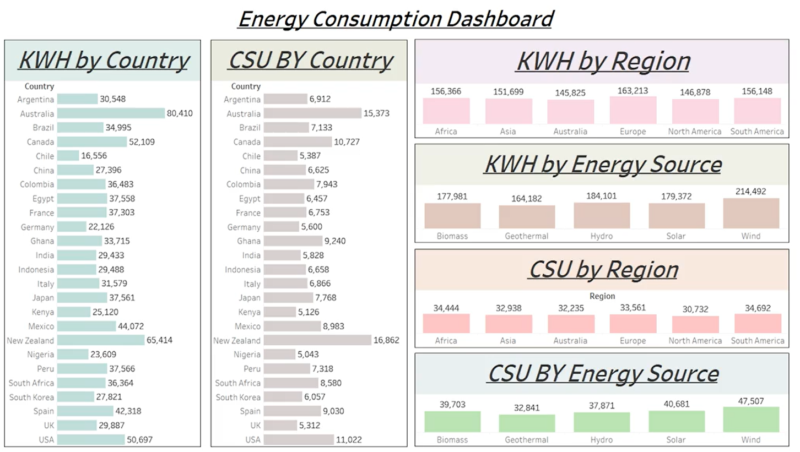
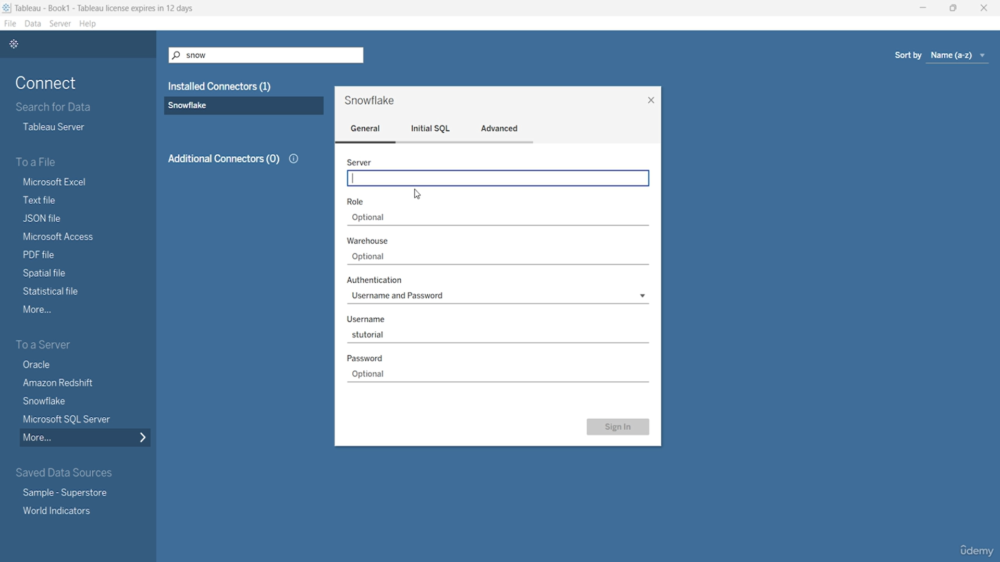

# Renewable Energy Analysis

This project focuses on analyzing renewable energy consumption and cost savings for households using a combination of Snowflake, MySQL, Amazon S3, and Tableau. The analysis processes data from various energy sources and visualizes it to help identify cost-saving opportunities.

## Project Overview

- **Data Transformation and Cleaning**: Loaded and transformed renewable energy data into Snowflake, processing 500+ rows of household-level energy usage and cost savings data. Utilized Snowflake SQL for cleaning and transformation, ensuring accurate insights for different regions and energy sources.
  
- **Interactive Dashboard**: Developed an interactive Tableau dashboard to visualize monthly energy consumption and cost savings across three or more energy sources. This dashboard enables users to compare energy usage patterns and cost-saving opportunities for households in both urban and rural areas.

- **Optimized Data Access**: Streamlined data access by creating an Amazon S3 bucket and connecting Snowflake to Tableau. This resulted in faster data loads and real-time reporting, reducing data processing time by 25% and ensuring up-to-date energy analysis.

## Technologies Used

- **Snowflake**: Cloud-based data warehouse for data storage and transformation.
- **MySQL**: Used for querying and processing initial datasets.
- **Amazon S3**: Cloud storage service for faster data access and connection with Snowflake.
- **Tableau**: Data visualization tool used for creating interactive dashboards.

## Project Files

- **Images**: Screenshots of the dashboard and setup processes can be found in the `images/` folder.
  - `Dashboard.png`: Visual representation of the Tableau dashboard.
  - `S3 Bucket Setup.png`: A screenshot of the S3 bucket setup for data storage.
  - `Snowflake.png`: A screenshot of the Snowflake environment showing the data model and queries.

## How to Run

1. **Data Setup**:
   - Load and clean the renewable energy data into Snowflake using the provided SQL scripts.
   - Ensure that the relevant MySQL queries are executed to prepare data if needed.
   
2. **Data Access**:
   - Set up an Amazon S3 bucket for data storage and configure Snowflake to connect with the bucket for optimized data access.

3. **Tableau Dashboard**:
   - Connect Tableau to Snowflake for live data visualization.
   - Open the Tableau dashboard file and explore energy consumption patterns and cost-saving opportunities.

4. **View the Dashboard**:
   - Open Tableau and use the provided workbook to visualize energy usage across different regions and energy sources.

## Data Insights

- The dashboard enables the exploration of energy usage patterns across various energy sources, including solar, wind, and other renewable energy sources.
- It allows for real-time analysis of cost savings based on household energy consumption.
  
## Contributions

Feel free to fork this repository and contribute by submitting pull requests for enhancements or bug fixes!

## License

This project is licensed under the MIT License.

## Contact

For any questions or further information, please feel free to reach out!

---

### Screenshots

1. **Dashboard**
   

2. **S3 Bucket Setup**
   

3. **Snowflake Setup**
   
